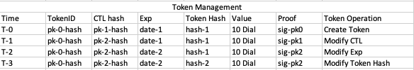

# DIAL White Paper
# Motivation
Web3 is struggling with finding the correct architecture. Fully mature and apparently decentralized applications appear to be giving way to censorship, because end user access to peer-to-peer networks are routed through API servers that are under the control of centralized organizations.

As we figure out that end user devices are not designed to be full citizen of peer to peer networks, API layers are establishing themselves as foundation for good user experience in Web3.

This paper describes a network that creates an economy for the deployment of scalable, open, permissionless and nano payment capable API networks. The latest will in turn open room for the deployment of truly decentralized and censorship resistant web3 applications.

# Excourse Token Management
A token management system can maintain a list of tokens. Each token can have a controller property that indicates who can modify the token. The following picture displays a database table in which the state of a single token is tracked.

To understand the table above, let's describe it's columns:
- Column "Time" is displayed to show that those modifications do not occur in parallel.  
- Column "TokenID" holds a unique identifier for the token. This identifier is also a public key hash. Using a public key as identifier helps enforce proof of possession (PoP) of the corresponding private key at token creation time, thus preventing the presentation of two creation requests with the saame token identifier.
- Columnn "CTL hash" displays the hash of the public key that guards the token. This is the key used to enforce legitimate modification of the token.
- Column "Exp" allow the maintenance of a expiration date. Token will be retired upon reaching that date unless extended by the token controller.
- "Token Hash" is an information not relevant for the management of the transfer of the token, but might help parties ensure integrity of the content of the token.
- Column "Value" extends the table with a simple arithmeticc that allows the aggregation of tokens of the same value type.
- Column "Proof" documents the PoP used to legitimate modification on the token. To modify a token, the controller must prove possession of the private key matching the public key found in field CTL-hash. This means the controller must sign the modification request with the private key matching the public key found in the CTL-hash field. That signature is displayed in this Proof column.

Although the simplest implementation of this token management system can be provided by a centralized database server, the central architecture won't be suitable for the deployment of scalable, open, permissionless, and censorship resistant, nano payment capable API networks.

This last remark push us toward the design of an equivalent system but distributed, open and permissionless.

# Abstract
The Dial __(Distributed Immutable Assertion Log)__ is a distributed log holding state of __tokens__.
 Token can be created or modified using __declarations__. Each token is (1) created or modified by the token __controller__, (2) verified and certified by many __publishers__.

 The Dial only documents the last state of a token. It does not keep the change history of the token.

 The Dial only knows the identifier, the content hash and the authorization hash of a token. Payload information is held by interrested parties (generally the controller).

 The overall state the Dial at any given __moment__ is allways partitioned among publishers. No publisher is required to hold all files. A simple and deterministic algorithm allows the location of the group of publishers holding the state of a given token, knowing the __token identifier__ and a so called __anchor__.

 As the Dial is open and permissionless, publishers might join and leave at will. This opennes justifies the requirement, not to keep a token under the custodianship of a single publisher for an unlimited amount of time. To enable the __transfer of custodianship__ to other publishers, the Dial defines time slices called __time windows__. Each time window starts at the __UTC Hour__ and ends before the next __UTC Hour__. At the end of a time window, the last state of each token is passed by the current custodians (publishers holding the token) to new custodians.

To allow for parallel proccessing of tokens, the Dial scales by __partitioning__ publishers of a given time window into groups called __neighborhoods__. Inside the time window, each token is assigned to exactely one neighborhood. This way, changes on a single token inside a time window are all verified by the same set of validators, thus preventing the certification of conflicting changes.

The Dial __sustainability policy__ requires each token to be associated with payments substantial enough to maintain the token toward its expiration. The total value held by the Dial and released to publishers as time window go by is the motivating factor for publishers to join and service future time windows.

# Consensus
The open and permissionless character of the Dial might leave room for opportunistic and/or spammy behavior. 

## Proof of Work
All requests to the Dial are required to provide a Proof of Work __(PoW)__. The required PoW is substantial enougth to prevent spammy behavior of the requesting participant.

The Dial __monetary policy__ allows the mining of coins out of participant's PoWs and the reuse of those coins for the payment of goods and services among Dial participants.

## Reputation
Permissionless participation is  also conditioned with a cumulative Proof of Work __(PoW)__ called __reputation__. The __reputation__ of a participant is the aggregation of the PoW performed so far by that participant. The reputation of a participant (sort of capital) exposes the participant to privileges like:
- the eligibility to perform as a publisher,
- the reduction of the PoW required for a given operation.

As the reputation is a sort of valuable capital, verifiable misbehaviour of a participant leads to the loss of that participant's reputation.

## Participant Opportunistic Behavior
A participant controlling a token is assumed the have sole control on corresponding key credentials. Submitting conflicting declarations to the network can occur by the mean of the participant sending different versions of that declaration to publishers. Even though this attempt will never succeed due to majority rules implemented by neighborhoods, the submitting participant will lose the PoW associated with the declaration. If this PoW is sponsored with by a reputation, the submitting participant will also loose that reputation.

## Publisher Opportunistic Behavior
Despite participants, which are given less room for opportunistic behavior, publishers are given the priviledge to:
- convert proof of work into coins,
- aggregate proof of work into reputations,
- verify and certify creation and modifications of tokens,
- verify and certify token operations (aggregation).

Not only is the Dial open and permissionless, the Dial also does not keep the change history of a token. As a result, the Dial can not expect any integrity from publishers. The integrity of the Dial is provided by the verification, certification, and publication workflow.

### Publication and Rejection Certificate
A __publication certificate__ is returned by a publisher to the submitting participant as a vote for inclusion of the creation or modification request into the Dial. A __rejection certificate__ tells a participant, that a creation or modification request is either not valid, or conflicting.

As declaration are always signed and acompanied with payment (resp. PoW),
- A declaration with invalid payment (PoW) is not proccessed,
- An invalide declaration with valid payment is processed, as publisher will collect the payment for the verification and documentaion of the invalid request.

A participant can consider a token published if none of the custodying publishers returns a rejection certificate.

### Controlling a Neighborhood
A group of related publishers could cordinate their effort in neighborhoods they controll to perform illegitimate modifications on tokens. Recall the a neighborhood can only be controlled if all publishers of the neighborhood are controlled, as a single controller issuing a rejection certificate will uncover te intended illegitimate modification. 

To prevent controll of neighborhood by publishers, the Dial's __Ephemeral Neighborhoods Protocol (ENP)__ secures a deterministic but __unpredictable__ association between each token and the neighborhood responsible for the validation of changes on that token in the given time window.

### Double Validation Workflow
The following picture displays the life cycle of declaration modifying a token, from the request for publication to the transfer of control to the subsequent time window. Solid lines cover the process from the submission of a declaration to the reception of the publication certificate by the submitting participant. Dashed lines describe operations performed at the closing of a time window.

Creating or modifying a token occurs by the mean of the current controller submitting a new declaration. To publish a declaration, (1) the current controller submits the declaration to one or more publishers of the token neighborhood (THost). (2) Addressed publishers verify the declaration and share the declaration with all other publishers of that neighborhood. (3) Each publisher of that neighborhood produces a certificate (PCert), (4) share this certificate with other controllers of the same neighborhood and (5) returns the certificate to the submitting controller. The declaration is considered published when the submitting controller is in possession of at least one PCerts and zero rejection certificate. Publishing does not reflect successfull modification, as rejection certificates will also be published.

The picture above shows that each token is randomly validated by at least two neighborhoods. The neighborhood hosting the token in the current time window (THost) and the neighborhood hosting the token in the subsequent time window.

With the unpredictable distribution of publishers to neighborhoods and the possibility for a single publisher to uncover wrong doing, a group of malicious publishers must cover a substantial part of the network to successfully induce the illegitimate modification of a single token, as the group has to corrupt all publishers of two randomly built neighborhoods in subsequent time windows to achieve capability of corrupting a single token.

The highest assurance is provided, when control is transfered to publishers of the subsequent time window, as a second validation of each declaration takes place there.

### Closing a Time Window
As displaayed in the picture above, following activities are performed at the end of the time window.

- (6) Each publisher of the token neighborhood creates a eighborhood protocol and (7) sends that protocol to the time window host.
- (8) Each publisher of the time window host produces a time window protoccol, (9) shaare the TWP with all publishers of the time window and (10) shares it with the time window host a computed in the subsequent time window (TW+1)
- (10) Each publisher traansfers it's neighboorhood protocol (NP) to all publishers of the neighborhood host in TW+1
- (10) Each publisher tansfers each token under custody to all publishers of the neighborhood hosting the token in TW+1
- (11) Each publisher of TW+1 verifies the token again and publishes the token with the neighborhood host in TW+1
- (12) Each publisher of the neighborhood host inn TW+1 rebuilds the protocol and compare with the received protocol. Then transfers the protocol the the time window host in TW+1.

Each publisher of the time window host of TW+1 can reproduce the protocol from neighborhood protocols and compare it with the one delivered by publishers of the time window host in TW.

# Key Entities

The following image displays a simplified layout of a time window.

## Time Window
The Dial is always inside a time winndow. The time window is the primary element of synnchronizationn inn the Dial network. It is represented with the keywork TW and the time stamp of the first second of the UTC Hour _TWYYYYMMDDHH_ e.g. _TW2022032415_. Each Participant can compute this identifier without any aadditional help.

## Time Window Anchor
The __Anchor__ is the most critical information of the dial network. The anchor of a time window is a __hash__ of the state of the dial at the end of the 56th minute of the precedent time window.

The Anchor is used to:
- partition publishers of the time winndow into neighborhoods
- determine the neighborhood hostingn a token
- determine the neighborhood responssible for the production of the protocol of this time window

The anchor is :
- produced by publishers of the neighborhood hosting the time window protocol,
- verified by all publishers of the time window
- distributed to other participant through a gossip protocol.

## Neighborhood
A neighborhood is a set of publishers commonly responsible for the guardianship of a set of tokens inside the given time window. The layout of neighborhoods in a time window is computed by publishers of the time window host and verified by all other publishers of the time window.

### Distance Vector Mapping
As displayed in the picture above, both publishers and tokens are assigned to neighborhoods by computing their respective __distance__ to the anchor.

Each neighborhood has the same number of publishers. In this case 11 publishers. The remaining group of publishers less than 11 does not serve for the given time window.

### Neighborhood hosting a Token (THost)
A token is said to be __hosted__ by a neighborhood if the ENP assigns that token to that neighborhood in the given time window. The neighborhood hosting a token is called __THost (for token host)__.

### Neighborhood hosting a Time Window (TWHost)
A time window itself is considered a token with the reserved identifier _TWYYYYMMDDHH_. The distance between the hash of this identifier and the anchor alows to locate the neighborhood responsible for that time window. This neighborhood is called the __TWHost (time window host)__ and is responsible for the publication of information on that time window e.g., the list of registered publishers and the time window protocol.

### Neighborhood hosting a Neighborhood (NHost)
Each neighborhood is also a token with the reserved unique identifier _NYYYYMMDDHH-I_ where _YYYYMMDDHH_ is the timestamp of the hosting time window, and _I_ is the position of the neighborhood relative to the time window anchor.

The distance between the hash of this identifier and the anchor can allow us to locate the neighborhood responsible for hosting that neighborhood. This neighborhood is called the __NHost (neighborhood host)__ and is responsible for the aggregation of the work done by publishers of the guest neighborhood and the publication of the guest neighborhood's protocol.

## Declaration - Token
A declaration can be submittet by a participant to create or modify a token. The existance of a token can span multiple time windows. The following picture displays 3 times windows in which the same token is modified using declarations. 

The first declaration (Declaration-0) creates the token. Subsequent declarations modify the token. Like displayed in TW2022031015, a token can be modified more than once in a single time window.

## Publisher
The entity responsible for the publication of a declaration into the Dial is called a __publisher__. Before insertion into the Dial, publishers of the neighborhood responsible for this token __(THost)__ verify that the submitted declaration is consistent with the state of the token as documented so far.

To act as a publisher in the time window TW+1, a publisher must register for performance in time window TW before the 56th minnute of the time window.

## Certificates
Certificates are proofs. They are not directly stored in the Dial but can be part of the hash documenting the authorization script of a token.

### Publication Certificate (PCert)
A __publication certificate (PCert)__ is a proof that the resulting state of the underlying token is is consistent witth the state of the token as documented so far. A participant can consider a token published if none of the custodying publishers returns a rejection certificate.

### Sharing Certificates (SCert)
All publishers of a neighborhood are required to share each produced certificate (VCert, PCert) with each other not later than in the __minute__ following the production of those certificates. This is essential as the earliest knowledge of each certificate will reduce the certification of conflicting declarations and help reduce noise and spam in the network.

To enforce sharing of produced certificates, redemption of coin associated with work done can only happen if publisher presents __Sharing Certificates (SCerts)__. These are receipts produced by other publishers after reception of certificates produced by their neighborhood peers.

## Protocols
A protocol is a merkel tree holding the state of some entities. The Dial knows three types of protocols:
- The token protocol
- the neighborhood protocol and 
- time window protocol.

### Incremental Computation of Merkel Roots
We can allow for incremental computation of a merkel root if we design the ordering criteria to append new leaf nodes at the end of the list of leaf nodes. All protocols in the Dial are designed such as to allow for the incremental  computation of merkel roots and therefore reduce the time needed to secure the state of the Dial between time windows.

### Token Protocol (TP)
A token protocol documents all certificates produced to secure the last state of a token in a merkel tree. The documentaation of the las state of a token is held by the controller of the token and shall be presented to publishers as part of a new declaration to modify the token.

By verifying the merkel root of the token state, the publisher can consume information contained in the token documentation to verify the legitimacy of the new modification request.

### Neighborhood Protocol (NP)
The NP is the merkel tree of the last state of all tokens hosted by the target neighborhood. The neighborhood protocol is produced by publishers of the THost.

To allow for incremental computation of neighborhood protocols, leaf nodes are ordered by (1) the timestamp of the token first publication and (2) the lexicographical order of the token identifier. This way, new tokens are appended at the end of the list and do not trigger a rebalance of the protocol tree.

### Intermediary Neighborhood Protocol (INP)
The INP is computed during the 57th minute of the time window and contains (1) the state of all unchanged tokens and (2) the state of all changed tokens from the first to the 56th minute. The INP must be sent to the TWHost before the end of the 57th minute.

Aspiring publishers of time window TW+1 must register for performance in TW, before the INP is computed. This list of publishers for TW+1 is available to publishers of each NHost at the time they are computing the INP. The partial list of publishers is sent together with the INP to the TWHost.

### Time Window Protocol (TWP)
The TWP is the merkel tree of all neighborhood protocols hosted by the time window. 

As the list of neighborhoods of a time window is known in advance, as well as their order, the merkel root of the TWP can be upgraded every time a publication certificate upgrades the NP.

### Intermediary Time Window Protocol (ITWP)
The ITWP is computed in the 58th minute of the time window and distributed in the 59th minute of the time window. It is used to determine the intermediary time window hash __(ITWH)__, which is the merkel root of the ITWP.

The ITWH is available from the 59th minute of the current time window and is used as the anchor of the subsequent time window.

After the ITWH of TW if computed, publishers of TWHost can pull the list of publishers of TW+1 and use it to compute the layout of TW+1.

### Final Neighborhood Protocol (NP)
The final neighborhood protocol is computed in the first minute of the subsequent time window by publishers of the respective NHost of the expiring time window. The change date is the last second of the expiring time window.
- NPs are sent to publishers of the TWHost of the expiring time window for the computation of the final time window protocol.
- NPs are sent to publishers of their hosting neighborhood in the new time window, in the context of the transfer of responsibility. These publishers will custody this protocol till the end of their own time window. These publishers also verify the proocols and forward them to the corresponding TWHost of the old time window in the new time window.

### Final Time Window Protocol (TWP)
The final time window protocol is computed in the third minute of the subsequent time window by the TWHost (of the old time window) and documented as such.

This TWP is then marked with the timestamp of the first second of the new time window and sent to publishers of the relevant neighborhood in the new time window  for documentation. Publishers of this neighborhood will custody the protocol for the duration of their own time window.

- The TWHost of the old time window in the new time window receives a time window protocol from the TWHost of the old time window in the old time window.
- The TWHost of the old time window in the new time window also receives the single time window hashes from NHost of the old neighborhoods in the new time window. Publishers of the TWHost of the old time window in the new time window can then use these neighborhood hashes to recompute the TWP and therefore verify the delivered protocol of the old time window.

The following picture illustrate both a time window protocol and attached neighborhood protocols.

### Verifying a Token
To validate a token at the end of a given time window, two partial merkel trees (PMT) are required:
- The PMT of the protocol neighborhood that hosted the token in the passed time window
- The PMT of the protocol of the passed time window.
Knowing the identifier of each of these documents, a participant can locate where to download the documents in the current time window.

# The Dial Economy
Due to it open and permissionless character, the Dial defines a value generation system to address spam and sustainability.

## Value Generation
Every single service performed by a Dial service provider (e.g. publisher) in the Dial is paid for by the requestor of that service. The price of some fundamental services (like the publication service) is set by the network. The price of other services is left to the discretion of the service provider. A __service intent request__ allows a requestor to collect prices and other execution conditions from different service providers.

## Spam Rsistance
Spam is the main thread to open and permissionless architectures. The Dial is built on top of a fundamental spam resistance system that makes sure the revenue generated from the publication of a single token is sufficient to cover present and future performance required to validate, maintain and retire that token. 

This is also a reason why each token carries an expiration date. After the expiration date, the token identifier is not known to the Dial and does not appear in the protocol.

In order to protect publishers (or service providers in general), the Dial requires each service request to be accompanied with a payment. Even the price inquiry service (a.k.a service intent request) is a payable service. Recall that the service intent request also returns a binding offer to the requesting party.

The price paid by a party to publish a declaration has a minimum cap, a file size factor, a validation effort factor and time to live factor. This price is generally substantial enough to have a significant impact on the wealth of the party generating spammy declarations.

These three factors (a) payment for intent request, (b) payment for publication and (c) the publisher registration constraint constitute together an effective spam resistance mechanism.

## Sustainability
Because of the built in expiration date for each token, the dial is designed to not keep bothersome histories. A Dial token is forgotten with the expiration of the token, if the token is not extended by the current controller. As stated above, each Dial token is covered with enough reserves to finance the security of the token till expiration.

The Dial also does not have a treasury. Each token caries it's maintenance budget in the form of attached coins. This maintenance budget is consumed as the token is passed from one time window to another till the token is removed from the log at expiration.

# Monetary Policy
Each coin in the Dial originates from a combination between a __Proof of Work__ and the __performance__ of a __canonical service__.

## Proof of Work (PoW)
The PoW is designed to enforce a relation between the value extracted from of a service consumed and the effort performed to legitimate the service request. The more balanced the relationship between the effort performed (input) and the value extracted (output), the lesser probable will a participant try to spam the system.

## Mining Coins out of PoW
The Dial allows a participant to perform some computation intensive work and use the resulting proof (PoW) to pay for the execution of a service. The service execution process transforms the provided PoW into a coin. This resulting coin is subsequently used in the Dial network as a mean of payment.

## Reputation
The reputation of a participant is the cumulated amount of PoW performed by that participant so far. This reputation exposes the participant to privileges:
- the registration as a service provider requires a participant to justify controll over a defined amount of cummulated PoW (called reputation)
- the amount of PoW required to submit a publication request is an inverse factor of the reputation of a participant. The bigger the reputation of a participant, the lesser is the PoW required from the participant for the submission of a publication request.

The reputation of a participant can also be attached to some operations as a guaranty of not double spending. Speeding up the off chain transaction of token and increasing the annonymity of the overall echosystem.

## Reducing Opportunistic Behavior
With respect to the open and permissionless character of the Dial, coin production must be designed such as to have the total coin supply reflect the volume of activity performed in the Dial network. With this in mind, the Dial wants to prevent participant (1)  from performing work just with the purpose of increasing the coin supply, (2) from extracting additional value out of the coin production process (e.g. by producing work for service requests directed to service providers known in advance).

In order to prevent opportunistic behavior, the Dial limits the conversion of PoW to coin to services which by their nature do not allow participants to behave oppotunistic. Currently identified services are:
- The publication service.
- The coin bundling service.

In this same rationale, the Dial allows a participant to attach it's reputation to an operation as a guaranty of honesty. Misbehavior will then lead to the participant losing this reputation.
