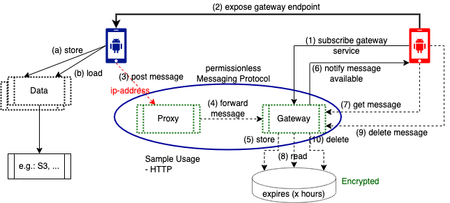

# Dial Service Architecture
Dial introduces a simple but privacy first, decentralized service protocol. The protocol is designed with the awareness that end user devices (like mobile phones) are network constrained. The protocol therefore introduces and rely on permanently available network nodes to expose network services to constrained devices. The protocol also takes advantage of hierharchical deterministic cryptographic keys (see BIP32) to improve privacy and annonymity of messages sent through open networks.

## Basic Architecture
The following picture, describes steps associated with moving a message from one endpoint to another.

### Gateway Service
This service plays the role an email server does in today's internet messaging architecture. IT can receive and store messages on the behalf of a participant.

### Proxy Service
The proxy service is an essential service, designed to improve the annonymity of end user devices in the network. The proxy service allows a network component to _receive_, _unpack_ and _forward_ a message to the next node. The proxy service allows the implementation of a routing similar to _onion_, but simple enougth to be applied at a larger scale.

The proxy service is essential for the implementation of privacy:
- as it allows group of participants to deploy proper network nodes to reduce the exposure of their end user devices to the rest of the network.
- as it allows a participant to define the route of a message to the recipient, effectively allowing to hide the origine of the message.

### Data Service
The data service allows a consumer to store data that can be retrieved by that same consumer at a later point of time.

## Permissionles Services
Designing a permissionless deployment and consumption of services in the web3 environment is far from being obvious. The perfect trust would be provided if there was a way to have each service request carry a payment, and a way of enforcing service execution upon reception of the payment. 

Some services like the data storage service inherently require the service to be provided over a period of time. If the payment occurs before the end of the storage time period, service provider migh stop provisioning without any accountability, thus taking consumer payment without performing the paid service. If payment occurs at the end, there might be no warranty consumer will pay for the service subscribed, as consumer might simply abandon the data stored with the service provider.

Additionally the network service model tries to be as permissionless as possible. 

This document provides a way of establishing trust and enforce contract terms between service providers and services consumers.

## Key Entities
### Network Service Operator (NSO)
An NSO manages a set of network service providers. The trust of an NSO is established by it's reputation. An NSO is responsible for keeping providers and consumers honest. 

Beside the reputation, this framework has no further ways of guarantying the trust of an NSO. Services are designed to allow for easy transition from an NSO to another one.

An NSO record contains:
- The type of service operated
- The price of the guarantee in percentage of service price (e.g. 10%)
- The list of crypto addresses target of service payment
- The list of public keys used to produce assertions

### Network Service Provider (NSP)
An NSP provides network services to devices with limited network and storage capabilities. Services are provided against payment. An NSP exposes a record certified by NSOs.

An NSP record contains:
- The type of service provided and corresponding performance unit (e.g. Data storage in Gigabytes)
- The service price in performance units
- The list of crypto addresses target of service payment
- The list of public keys used to produce assertions

### Network Service Consumer (NSC)
This is an entity that consumes the service exposed by an NSP. An NSC uses crypto currencies to pay for service consumed. Even though there is no other identification needed, a single service payment might be associated with many service requests. We call this a service subscription.

## Service Model
### Service Subscription
A service subscription allows a consumer to rely on the availability of the NSP for the duration of the service, as many service require execution to be performed over a period of time. Sample services are:
- data storage service: inherently time based
- relay service: time based. Sender post a packet and expect the relay to hold the packed for a defines time to live period.
- inbox service: time based. Recipient expect service to hold inbox documents for a defined period of time.

A service subscription is like the contract guarantying this availability. It contains:
- the service payment
- a sequence of request identifiers (use to decorrelate single service requests from each other)
- an NSP produced HD public key used for the encryption of service request and for the signature of service responses
- an NSC produced HD public key used to authenticate service requests

### Service Payment
A service subscription is accompanied with a conditional payment, in the best case a HTLC payment. The payment contains:
- an amount addressed to the NSP (e.g 90%)
- an amount addressed to the NSO (e.g 10%)
- 4 hashes of a combined secret. 
  - Part 1 know to the NSP, 
  - Part 2 known to the NSO, 
  - Parts 3 and 4 known to the NSC.
- an expiration time after which the payment wont be rediemable
The payment is therefore an HTLC transaction.

### Service Request
The service request will contain:
- a service identifier used to discoves the service subscritpion in the database of the NSP. Note that identifiers are not reused.
- the secret held by the service consumer and used to unlock the payment.
- the signed token produced by the consumer (with a child of the HD key) and used to authenticate the service request

